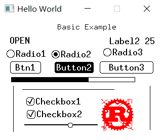
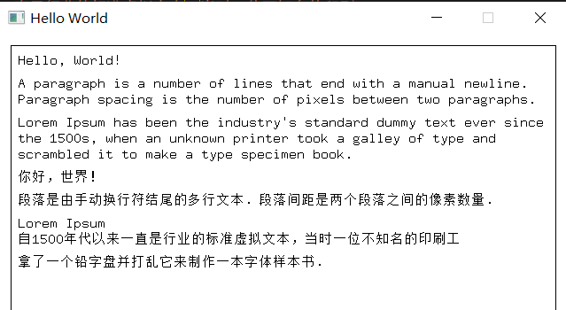
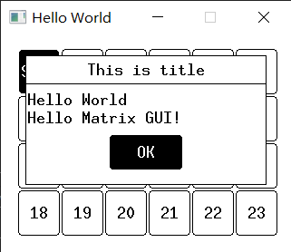
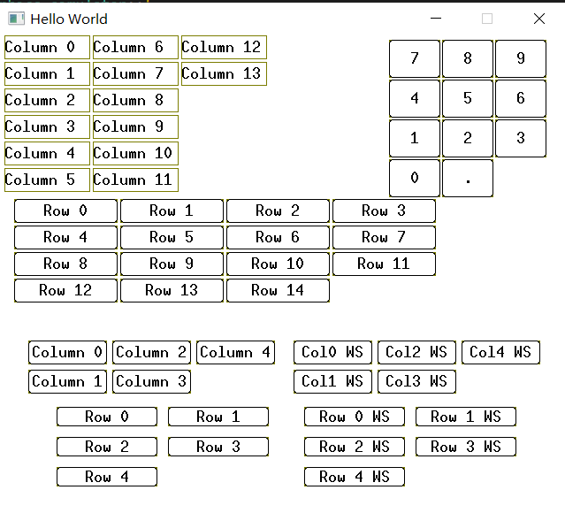

# Matrix GUI

[](https://opensource.org/licenses/MIT)
[](https://www.rust-lang.org/)
[](https://github.com/embedded-graphics/embedded-graphics)

**[🇨🇳 中文说明](README_zh.md)**

An immediate-mode embedded GUI framework inspired by [kolibri-embedded-gui](https://github.com/Yandrik/kolibri), built on top of [embedded-graphics](https://github.com/embedded-graphics/embedded-graphics). This framework removes automatic layout functionality and adopts a state ID-based approach with predefined rectangles as the layout framework.

## Features

- **Immediate-mode GUI**: Simple and intuitive API with minimal boilerplate
- **Zero-allocation design**: Except for control state values, all data resides on the stack, suitable for resource-constrained systems
- **Region-based layout**: Flexible free-form layout with predefined rectangular regions, providing layout design tools (Matrix GUI Layout)
- **Feature-based modularity**: Enable only the features you need to minimize binary size
- **`no_std` compatible**: Works seamlessly in bare-metal environments
- **Integer-based animations**: Lightweight animation system without floating-point operations
- **Custom widgets**: Easy to create custom widgets by referencing built-in widgets
- **Mixed font display**: Uses the multi-mono-font library, and CJK font generation can use the [PCtoLCD2022](https://gitee.com/merisy/PCtoLCD2022) tool

### Built-in Widgets

#### Static Widgets
- `Background` - Background clearing
- `Label` - Text labels
- `PlainText` - Multi-line text
- `StaticImage` - Static images
- `StaticLine` - Static lines
- `Bar` - Progress bars
- `ListBox` - List boxes

#### Interactive Widgets (requires `interaction` feature)
- `Button` - Buttons
- `Checkbox` - Checkboxes
- `RadioButton` - Radio buttons
- `Slider` - Sliders
- `MessageBox` - Message dialogs (requires `popup` feature)

## Screenshots

### Basic Example



A comprehensive example demonstrating various widgets including buttons, sliders, checkboxes, radio buttons, labels, and static images.

### Plain Text Widget



Multi-line text display widget with support for different fonts and styles.

### Message Box



Modal dialog widget for displaying messages and user interactions.

### Grid Layout



Compile-time grid layout example showing organized widget placement in a grid structure.

## Getting Started

### Installation

Add this to your `Cargo.toml`:

```toml
[dependencies]
matrix-gui = "0.1.0"
```

### Basic Example

```rust
use matrix_gui::prelude::*;
use embedded_graphics::pixelcolor::Rgb565;

// Define regions using macro
matrix_gui::free_form_region!(
    RegionId,
    (TITLE, 100, 6, 143, 24),
    (BUTTON, 20, 85, 61, 24),
    (LABEL, 19, 34, 130, 20),
);

fn main() {
    // Create display and UI context
    let mut display = SimulatorDisplay::<Rgb565>::new(Size::new(320, 240));
    let smartstates = RenderState::new_array::<REGIONID_COUNT>();
    let widget_states = WidgetStates::new(&smartstates);
    let style = rgb565_light_style();

    let mut ui = Ui::new_fullscreen(&mut display, &widget_states, &style);

    // Add widgets
    ui.add(Label::new(&Region::TITLE, "Hello World"));
    ui.add(Button::new(&Region::BUTTON, "Click Me"));

    // Handle interactions
    ui.interact(Interaction::Pressed(Point::new(100, 100)));
}
```

## Features

This library uses Cargo features to enable optional functionality. By default, no features are enabled, allowing you to choose exactly what you need.

### Feature Overview

| Feature | Description | Dependencies |
|---------|-------------|--------------|
| `interaction` | User interaction support (touch/mouse) | - |
| `focus` | Keyboard focus management | `interaction` |
| `animation` | Lightweight animation system | - |
| `popup` | Modal dialog support | - |
| `framebuffer` | Off-screen rendering support | - |
| `fill-rect` | Fast rectangle filling with hardware acceleration | - |
| `debug-color` | Debug color visualization | - |
| `log` | Logging support | `log` crate |
| `part` | Core feature bundle | `log`, `focus`, `debug-color`, `interaction`, `framebuffer` |
| `all` | Enable all features | `part`, `fill-rect`, `popup` |
| `anim` | Animation feature bundle | `animation`, `part` |

### Feature Details

#### `interaction`

Enables user interaction support including touch/mouse input and interactive widgets.

**Enables:**
- `Interaction` enum (Pressed, Drag, Release, Click)
- Interactive widgets (Button, Checkbox, RadioButton, Slider)
- Region collision detection
- Event handling

#### `focus`

Enables keyboard focus management for navigation and keyboard input.

**Dependencies:** `interaction`

**Enables:**
- `FocusState` focus state management
- `FocusTracker` focus tracking
- `Focused` enum (No, Yes, Trigger)
- Keyboard navigation support

#### `animation`

Enables a lightweight animation system using integer-only math.

**Enables:**
- `Anim` animation definition
- `Easing` functions (Linear, EaseIn, EaseOut, EaseInOut)
- `AnimManager` animation manager
- Fixed-point arithmetic (no floating-point operations)

#### `popup`

Enables modal dialog support.

**Enables:**
- `Modal` widget
- `MessageBox` widget
- Modal state management

#### `framebuffer`

Enables off-screen rendering support for double buffering and complex widget caching.

**Enables:**
- `WidgetFramebuf` framebuffer widget
- Off-screen rendering capabilities
- Buffer management

#### `fill-rect`

Enables direct fast rectangle filling.

**Enables:**
- `fill_with_color()` color filling
- `fill_with_buffer()` buffer filling

#### `debug-color`

Enables debug color visualization for development and layout verification.

**Enables:**
- Region boundary drawing
- Debug information display
- Development helper tools

## Layout Tools

The project provides rectangle layout tools for designing your UI layouts. Check the [releases page](https://github.com/Merisy-Thing/matrix-gui/releases) for layout tools and utilities.

## Examples

- [basic-example](examples/basic-example.rs) - Comprehensive example with various widgets
- [anim-demo](examples/anim-demo.rs) - Animation system demonstration
- [anim-by-ui](examples/anim-by-ui.rs) - UI-driven animation
- [fill-rect-fb](examples/fill-rect-fb.rs) - Framebuffer with fill-rect optimization
- [list-box](examples/list-box.rs) - List box widget example
- [msg-box](examples/msg-box.rs) - Message box example
- [plain-text](examples/plain-text.rs) - Plain text widget
- [grid-layout](examples/grid-layout.rs) - Grid layout example
- [const-grid-layout](examples/const-grid-layout.rs) - Compile-time grid layout

Run examples with:

```bash
cargo run --features part --example basic-example
cargo run --features anim --example anim-by-ui
cargo run --features popup,part --example msg-box
```

## License

This project is licensed under the MIT License - see the [LICENSE-MIT](LICENSE-MIT) file for details.

## Acknowledgments

- Inspired by [kolibri-embedded-gui](https://github.com/Yandrik/kolibri)
- Built on top of [embedded-graphics](https://github.com/embedded-graphics/embedded-graphics)
- Uses [multi-mono-font](https://github.com/finnbear/multi-mono-font) for font rendering

## Contributing

Contributions are welcome! Please feel free to submit a Pull Request.

## Support

For issues, questions, or suggestions, please open an issue on GitHub.
